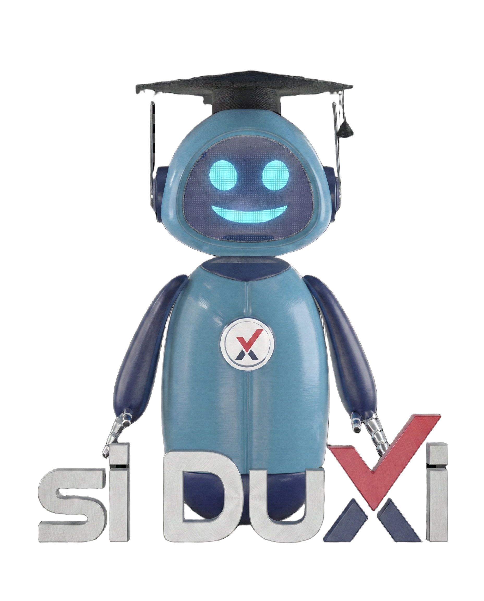

# SDLC Inixindo Gamification 🎮

Game edukasi interaktif untuk mempelajari tahapan **System Development Life Cycle (SDLC)**. Dikembangkan dengan **HTML5, CSS3, dan Vanilla JavaScript**, dilengkapi dengan fitur **Hand Tracking** berbasis Computer Vision.



## ✨ Fitur Utama

- **Drag & Drop Gameplay**: Susun tahapan SDLC (Requirement s.d. Maintenance) dengan urutan yang benar.
- **Hand Tracking Mode**: Kontrol kursor menggunakan gerakan tangan (MediaPipe Hands).
    - **Pinch to Grab**: Cubit jari telunjuk & jempol untuk memindahkan item.
    - **Pinch to Click**: Cubit di atas tombol untuk klik.
- **Audio Experience**: 
    - BGM (Background Music) yang menenangkan.
    - Efek suara kemenangan (Celebration) & Confetti.
    - Overlay "Start Game" untuk memastikan audio berjalan lancar.
- **Interactive Feedback**:
    - **Custom Modal**: Notifikasi visual yang menarik (bukan alert browser biasa).
    - **Validation**: Cek apakah urutan benar atau ada item jebakan (distractors).
    - **Siduxi Mascot**: Maskot asisten virtual Inixindo yang menemani permainan.

## 🛠️ Teknologi

- **Frontend**: HTML5, CSS3 (Custom Animations), JavaScript (ES6+).
- **AI/CV**: [MediaPipe Hands](https://google.github.io/mediapipe/solutions/hands) untuk hand tracking langsung di browser.
- **Libraries**:
    - `canvas-confetti`: Efek selebrasi.
    - Google Fonts (Inter).

## 🚀 Cara Menjalankan

Karena proyek ini menggunakan fitur kamera dan modul ES6, disarankan menjalankannya menggunakan **Local Server**.

### Opsi 1: Menggunakan Python
Jika Anda memiliki Python terinstal:
```bash
# Buka terminal di folder proyek
python -m http.server 8000
# Buka browser di http://localhost:8000
```

### Opsi 2: Menggunakan VS Code Live Server
1. Buka folder proyek di VS Code.
2. Install ekstensi **Live Server**.
3. Klik kanan pada `index.html` -> **Open with Live Server**.

### Opsi 3: Node.js (http-server)
```bash
npx http-server .
```

## 📂 Struktur Folder

```
Gamifikasi-SDLC/
├── index.html          # Struktur utama aplikasi
├── style.css           # Styling & Animasi
├── game-logic.js       # Logika permainan (Drag-drop, Validasi, Modal)
├── hand-tracking.js    # Logic Computer Vision & Gesture Control
├── audio-manager.js    # Pengaturan Audio (BGM & SFX)
├── Sound BG 1.mp3      # File musik latar
├── Sound Yay.mp3       # File efek suara menang
├── inixindo-logo.png   # Logo Inixindo Jogja
└── siduxi.png          # Maskot Siduxi
```

## 🎮 Cara Bermain

1. **Mulai**: Klik tombol "MULAI GAME" pada layar sambutan.
2. **Pilih Mode**: Gunakan Mouse (default) atau aktifkan toogle **Hand Tracking Mode**.
3. **Susun Tahapan**:
    - Ambil item dari panel kiri (Fase & Opsi).
    - Drag ke panel kanan (Urutan Siklus).
    - **Hati-hati!** Ada item pengecoh (Distractors) yang bukan bagian dari SDLC.
4. **Validasi**: Klik tombol **Check Structure**.
    - Jika benar: Akan muncul efek confetti dan suara kemenangan.
    - Jika salah: Baca pesan error pada modal untuk petunjuk.

---
**Developed for Inixindo Jogja**
*Mari belajar SDLC dengan cara yang menyenangkan!*
